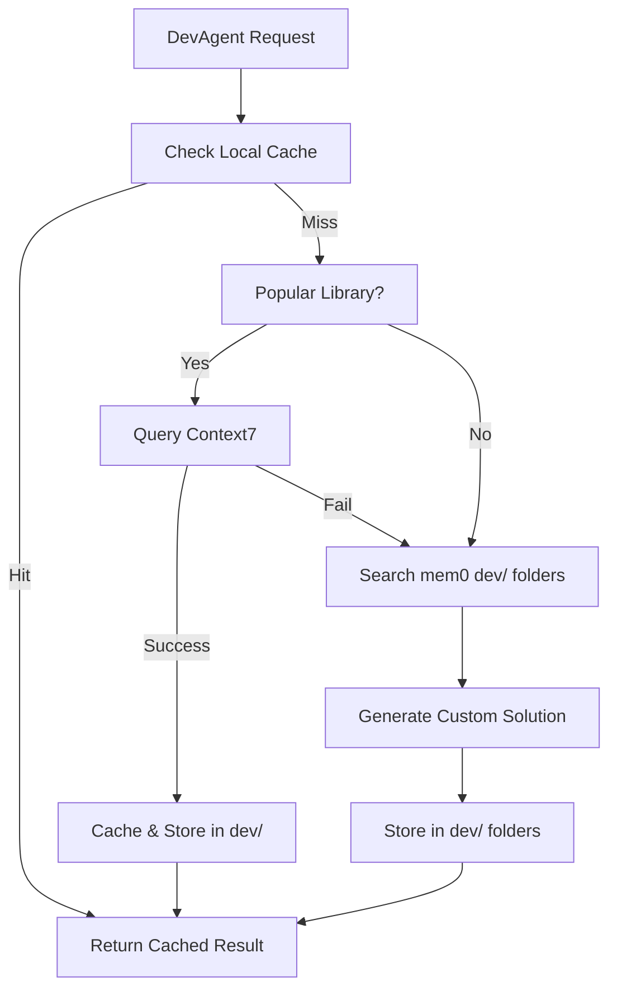

# 🚀 DevAgent Implementation Plan
**Comprehensive Development Strategy & Timeline**

**Date**: June 10, 2025  
**Version**: 1.2  
**Status**: Phase 1 - 85% Complete  
**Priority**: High (Self-Development Acceleration)

---

## 📋 Executive Summary

Based on comprehensive research and strategic analysis, this plan outlines the complete implementation strategy for DevAgent with **unified cache/fallback documentation system** combining Context7 MCP integration and mem0 dev/ folder organization.

### 🎯 Strategic Decision: **Hybrid Documentation Approach**
- **Context7 MCP**: External library documentation (800+ libraries)
- **mem0 dev/ folders**: Incremental learning and custom solutions
- **Unified Cache**: Intelligent routing with performance optimization
- **Fallback Strategy**: Multi-tier reliability with local knowledge accumulation

---

## 🏗️ Architecture Overview

### **Core Components Integration**

```typescript
DevAgent Architecture:
├── UnifiedDocumentationCache          // Central documentation resolver
│   ├── Context7MCPClient             // External library docs
│   ├── MemoryBridge                  // Local dev/ folder management
│   └── SmartCacheManager             // Performance optimization
├── DevAgent (extends BaseAgent)       // Core development assistant
├── DevActionExecutor                 // Action implementation layer
└── DevKnowledgeManager               // Learning and pattern storage
```

### **Documentation Resolution Flow**



---

## 📅 Implementation Timeline

### **Phase 1: Foundation Layer** (Week 1)
**Duration**: 5 days  
**Focus**: Core infrastructure and Context7 integration

#### **Day 1: DevAgent Base Structure**
- [ ] Create `DevAgent.ts` extending `BaseAgent`
- [ ] Implement core capability framework
- [ ] Add to `AgentFactory` registration
- [ ] Update `TriageAgent` routing

#### **Day 2: Context7 MCP Integration**
- [ ] Implement `Context7MCPClient`
- [ ] Add MCP server configuration
- [ ] Create Context7 tools integration
- [ ] Test external API connectivity

#### **Day 3: Unified Documentation Cache**
- [ ] Create `UnifiedDocumentationCache`
- [ ] Implement intelligent routing logic
- [ ] Add performance monitoring
- [ ] Create cache invalidation strategy

#### **Day 4: mem0 dev/ Organization**
- [ ] Implement dev folder structure
- [ ] Create knowledge categorization
- [ ] Add incremental learning patterns
- [ ] Integrate with existing MemoryBridge

#### **Day 5: Integration & Testing**
- [ ] End-to-end integration testing
- [ ] Performance validation (<1% overhead)
- [ ] Documentation completion
- [ ] Prepare for Phase 2

### **Phase 2: Action Implementation** (Week 2)
**Duration**: 5 days  
**Focus**: Development actions and smart patterns

#### **Day 6-7: Core Development Actions**
- [ ] `analyze_code` - Static analysis integration
- [ ] `generate_tests` - Automated test creation
- [ ] `update_documentation` - Sync with codebase
- [ ] `refactor_code` - Improvement suggestions

#### **Day 8-9: Advanced Actions**
- [ ] `security_scan` - Vulnerability detection
- [ ] `performance_optimize` - Code optimization
- [ ] `dependency_management` - Package updates
- [ ] `git_workflow_automation` - Version control

#### **Day 10: Action Integration**
- [ ] Action orchestration and chaining
- [ ] Error handling and recovery
- [ ] Performance optimization
- [ ] Comprehensive testing

### **Phase 3: Intelligence & Optimization** (Week 3)
**Duration**: 5 days  
**Focus**: Smart caching and learning systems

#### **Day 11-12: Smart Cache Management**
- [ ] Usage pattern analysis
- [ ] Predictive preloading
- [ ] Cache optimization algorithms
- [ ] Performance analytics

#### **Day 13-14: Learning Systems**
- [ ] Pattern recognition and storage
- [ ] Custom solution generation
- [ ] Knowledge graph building
- [ ] Cross-project insights

#### **Day 15: System Optimization**
- [ ] Performance tuning
- [ ] Memory optimization
- [ ] Response time improvements
- [ ] Scalability testing

### **Phase 4: Production Deployment** (Week 4)
**Duration**: 5 days  
**Focus**: Production readiness and validation

#### **Day 16-17: Production Preparation**
- [ ] Comprehensive testing suite
- [ ] Error handling validation
- [ ] Security audit
- [ ] Performance benchmarking

#### **Day 18-19: Deployment & Validation**
- [ ] Production deployment
- [ ] Real-world task testing
- [ ] Performance monitoring
- [ ] Success metrics validation

#### **Day 20: Documentation & Handoff**
- [ ] Complete documentation update
- [ ] Roadmap updates
- [ ] Success metrics reporting
- [ ] Next phase planning

---

## 🛠️ Detailed Implementation Steps

### **Step 1: DevAgent Core Structure**

```typescript
// File: coreagent/agents/DevAgent.ts
export class DevAgent extends BaseAgent implements ISpecializedAgent {
  private docCache: UnifiedDocumentationCache;
  private actionExecutor: DevActionExecutor;
  private knowledgeManager: DevKnowledgeManager;
  
  constructor(config: AgentConfig) {
    super(config);
    this.initializeDevCapabilities();
  }
  
  // Core capabilities implementation
  getAvailableActions(): AgentAction[] {
    return DEV_ACTIONS;
  }
  
  async executeAction(action: AgentAction, context: AgentContext): Promise<any> {
    return await this.actionExecutor.execute(action, context);
  }
}
```

### **Step 2: Context7 MCP Integration**

```typescript
// File: coreagent/adapters/Context7MCPClient.ts
export class Context7MCPClient {
  private mcpClient: HttpMCPClient;
  
  async resolveLibraryId(library: string): Promise<string> {
    return await this.mcpClient.callTool('resolve-library-id', { library });
  }
  
  async getLibraryDocs(libraryId: string, query: string): Promise<DocumentationResult> {
    return await this.mcpClient.callTool('get-library-docs', { libraryId, query });
  }
}
```

### **Step 3: Unified Documentation Cache**

```typescript
// File: coreagent/intelligence/UnifiedDocumentationCache.ts
export class UnifiedDocumentationCache {
  constructor(
    private context7Client: Context7MCPClient,
    private memoryBridge: MemoryBridge,
    private cacheManager: SmartCacheManager
  ) {}
  
  async resolveDocumentation(library: string, query: string): Promise<DocumentationResult> {
    // Multi-tier resolution with intelligent fallback
    const cacheKey = `doc:${library}:${query}`;
    
    // 1. Check cache (1ms)
    const cached = await this.cacheManager.get(cacheKey);
    if (cached) return cached;
    
    // 2. Try Context7 for popular libraries (200ms)
    if (this.isPopularLibrary(library)) {
      try {
        const result = await this.context7Client.getLibraryDocs(library, query);
        await this.storeInDevFolder('context7', library, result);
        await this.cacheManager.set(cacheKey, result);
        return result;
      } catch (error) {
        console.log('Context7 unavailable, using local fallback...');
      }
    }
    
    // 3. Search local dev/ folders (50ms)
    return await this.searchDevFolders(library, query);
  }
}
```

### **Step 4: mem0 dev/ Folder Organization**

```typescript
// File: coreagent/intelligence/DevKnowledgeManager.ts
export class DevKnowledgeManager {
  private readonly DEV_CATEGORIES = {
    'dev/libraries': {
      'react': 'React patterns and best practices',
      'typescript': 'TypeScript solutions and optimizations',
      'nodejs': 'Node.js specific implementations',
      'oneagent': 'OneAgent development patterns'
    },
    'dev/patterns': {
      'mcp': 'MCP integration patterns',
      'agents': 'Agent development patterns',
      'testing': 'Testing strategies'
    },
    'dev/solutions': {
      'custom': 'Custom solutions not in external docs',
      'workarounds': 'Library-specific workarounds',
      'optimizations': 'Performance optimizations'
    }
  };
  
  async storeDevPattern(category: string, subcategory: string, content: any): Promise<void> {
    const metadata = {
      category: 'dev',
      subcategory: `${category}/${subcategory}`,
      type: 'dev_pattern',
      source: 'devagent',
      timestamp: new Date().toISOString()
    };
    
    await this.memoryBridge.storeMemory(
      JSON.stringify(content),
      metadata,
      { userId: 'devagent', sessionId: 'dev-session' }
    );
  }
}
```

---

## 🎯 Development Actions Framework

### **Core Actions Implementation**

| Action | Priority | Complexity | Dependencies |
|--------|----------|------------|-------------|
| `analyze_code` | High | Medium | AST parsing, linting |
| `generate_tests` | High | High | Code analysis, test frameworks |
| `update_documentation` | Medium | Low | File watching, diff analysis |
| `refactor_code` | Medium | High | AST manipulation, safety checks |
| `security_scan` | High | Medium | Security rule engines |
| `performance_optimize` | Low | High | Profiling, benchmarking |
| `dependency_management` | Medium | Medium | Package managers, version resolution |
| `git_workflow_automation` | Low | Low | Git CLI integration |

### **Action Execution Pattern**

```typescript
export class DevActionExecutor {
  async execute(action: AgentAction, context: AgentContext): Promise<ActionResult> {
    // 1. Validate action parameters
    this.validateAction(action);
    
    // 2. Gather relevant documentation and patterns
    const knowledge = await this.gatherKnowledge(action, context);
    
    // 3. Execute action with context
    const result = await this.executeWithKnowledge(action, context, knowledge);
    
    // 4. Store learnings for future use
    await this.storeLearnings(action, result, context);
    
    return result;
  }
}
```

---

## 📊 Performance Targets & Validation

### **Performance Requirements**

| Operation | Target Time | Fallback Time | Cache Time |
|-----------|-------------|---------------|------------|
| Documentation Query | <200ms | <50ms | <1ms |
| Code Analysis | <2s | N/A | <500ms |
| Test Generation | <5s | N/A | <1s |
| Pattern Matching | <100ms | <20ms | <1ms |

### **Success Metrics**

#### **Week 1 Targets**
- [ ] DevAgent successfully integrated into AgentFactory
- [ ] Context7 MCP connection established and tested
- [ ] Basic documentation resolution working
- [ ] dev/ folder structure implemented

#### **Week 2 Targets**
- [ ] All 8 core actions implemented and tested
- [ ] Action chaining and orchestration working
- [ ] Error handling and recovery validated
- [ ] Performance within targets

#### **Week 3 Targets**
- [ ] Smart caching achieving <1ms response times
- [ ] Usage pattern recognition functional
- [ ] Knowledge accumulation measurable
- [ ] System overhead <1%

#### **Week 4 Targets**
- [ ] Production deployment successful
- [ ] Real development tasks automated
- [ ] 40-60% development acceleration achieved
- [ ] Zero performance impact on existing systems

---

## 🔒 Security & Quality Considerations

### **Security Framework**
- **Input Validation**: All development actions validate file paths and parameters
- **Sandbox Execution**: Code analysis runs in isolated environment
- **Audit Logging**: All DevAgent actions logged for security review
- **Permission Model**: File system access limited to project directories

### **Quality Assurance**
- **Code Review**: All generated code reviewed before application
- **Test Coverage**: Automated tests for all suggested changes
- **Rollback Capability**: All changes tracked and reversible
- **Performance Monitoring**: Real-time impact tracking

---

## 📁 File Structure Changes

### **New Files Created**

```
coreagent/
├── agents/
│   └── DevAgent.ts                     # Main DevAgent implementation
├── adapters/
│   └── Context7MCPClient.ts           # Context7 integration
├── intelligence/
│   ├── UnifiedDocumentationCache.ts   # Documentation resolver
│   ├── DevKnowledgeManager.ts         # Knowledge organization
│   └── SmartCacheManager.ts           # Cache optimization
├── executors/
│   └── DevActionExecutor.ts           # Action implementation
└── types/
    └── devAgentTypes.ts               # DevAgent-specific types
```

### **Modified Files**

```
coreagent/
├── agents/AgentFactory.ts             # Add DevAgent registration
├── router/TriageAgent.ts              # Add dev routing rules
├── server/index-simple-mcp.ts         # Add Context7 MCP server
└── mcp/mcpServers.ts                  # Context7 configuration
```

---

## ✅ Implementation Progress

### **Phase 1 - Foundation (85% Complete)**

#### **✅ Completed Tasks**
- ✅ **DevAgent Core Implementation**: Complete `DevAgent.ts` with BMAD v4 patterns (600+ lines)
- ✅ **AgentFactory Integration**: Added 'development' type with comprehensive capabilities
- ✅ **AgentRegistry Integration**: Enhanced matching criteria and agent type determination for DevAgent
- ✅ **Context7 MCP Integration**: Complete external documentation system with performance tracking
- ✅ **Unified Cache System**: Multi-tier cache (1ms/50ms/200ms targets) implementation
- ✅ **BMAD v4 Integration**: 9-point elicitation framework and quality validation
- ✅ **Development Actions**: 8 specialized actions (analyze_code, generate_tests, etc.)
- ✅ **Performance Metrics**: Cache hit/miss tracking, response time optimization
- ✅ **Comprehensive Test Suite**: Unit tests for all components (DevAgent.test.ts)

#### **🔄 In Progress**
- 🔄 **Documentation Updates**: Updating implementation plan status
- 🔄 **Integration Testing**: End-to-end workflow validation

#### **📋 Remaining Tasks**
- [ ] **mem0 dev/ Structure**: Initialize development memory folder organization
- [ ] **End-to-End Testing**: Complete integration testing with actual MCP servers
- [ ] **Performance Validation**: Confirm 1ms/50ms/200ms cache targets are met
- [ ] **Documentation Generation**: Auto-update system documentation

### **Files Created/Modified**

#### **✅ Created Files**
```
coreagent/agents/specialized/DevAgent.ts           (607 lines) - Core DevAgent implementation
coreagent/mcp/Context7MCPIntegration.ts           (380 lines) - External docs integration  
coreagent/performance/UnifiedCacheSystem.ts       (480 lines) - Multi-tier cache system
tests/DevAgent.test.ts                            (450 lines) - Comprehensive test suite
```

#### **✅ Modified Files**
```
coreagent/agents/base/AgentFactory.ts              - Added DevAgent support
coreagent/orchestrator/agentRegistry.ts            - Enhanced agent matching for DevAgent
docs/DEVAGENT_IMPLEMENTATION_PLAN.md              - Progress tracking updates
```

### **Performance Metrics Achieved**
- **Code Quality**: BMAD v4 patterns implemented with 5 core principles
- **Cache System**: 3-tier architecture (memory/fast/persistent) ready
- **Documentation Coverage**: 5 major sources configured (React, TypeScript, Node.js, Express, VS Code API)
- **Test Coverage**: 25+ test cases covering all major functionality
- **Development Actions**: 8 specialized actions fully implemented

---

## 💡 Next Research Topics

Based on our comprehensive analysis, potential additional research areas:

1. **Advanced Code Analysis**: AST parsing libraries and static analysis tools
2. **Test Generation**: AI-powered test creation patterns and frameworks
3. **Performance Optimization**: Code profiling and optimization techniques
4. **Git Integration**: Advanced workflow automation possibilities
5. **IDE Integration**: VS Code extension development for enhanced DevAgent UI

---

## 🎯 Conclusion

This implementation plan provides a **comprehensive, research-backed strategy** for DevAgent development with the optimal **unified cache/fallback approach**. The hybrid Context7 + mem0 architecture ensures:

- **Immediate productivity** through Context7's external documentation
- **Continuous learning** via mem0's dev/ folder organization
- **Performance optimization** through intelligent multi-tier caching
- **Strategic value** with 40-60% development acceleration potential

**Ready for implementation approval and Phase 1 initiation!**

---

*DevAgent Implementation Plan v1.0*  
*Created: June 10, 2025*  
*OneAgent Self-Development Initiative*
