# 🚀 OneAgent Next Phase Implementation Roadmap
**Post-Optimization Phase** | **Updated: June 12, 2025**

## 📋 Executive Summary & Current Status

### ✅ **PHASE 2A: FOUNDATION ENHANCEMENT** - **COMPLETE**
OneAgent has successfully completed Phase 2A: Foundation Enhancement with **exceptional results**:

**🎯 Key Achievements** (Completed via commit `f799734`):
- ✅ **Real-time Memory Health Monitoring**: Implemented using `triageAgent.revalidateMemorySystem()` for continuous system validation
- ✅ **Audit System Consolidation**: Eliminated 105 lines of duplicate code, standardized on production audit logger
- ✅ **System Quality Enhancement**: Current **89.6% quality score** (Grade A) - exceeding 85% target
- ✅ **Zero Compilation Errors**: All TypeScript issues resolved with optimal memory performance maintained

**📊 Current Performance Metrics** (June 12, 2025):
- Quality Score: **89.6%** (Grade A) - Target: 85% ✅
- Constitutional AI Compliance: **100%** - Target: 100% ✅
- Error Rate: **0.55%** - Target: <1% ✅
- System Health: **Healthy** - Target: Optimal 🔄
- Memory Performance: **Optimal** - Maintained throughout ✅

### 🚀 **NEXT PHASE ROADMAP OVERVIEW**

| Phase | Timeline | Status | Primary Focus |
|-------|----------|--------|---------------|
| **Phase 2A: Foundation** | ✅ **COMPLETE** | June 2025 | Real-time monitoring & audit consolidation |
| **Phase 2B: Advanced Features** | 🚀 **READY** | June-July 2025 | Time awareness & smart monitoring |
| **Phase 2C: Optimization** | 🎯 **PLANNED** | July-August 2025 | Integration testing & documentation |

**Strategic Value**: Phase 2A success provides robust foundation for advanced AI capabilities including temporal context awareness and predictive performance optimization.

## 📋 Implementation Priority Matrix

### 🚀 **PHASE 2B: ADVANCED FEATURES** - **READY FOR IMPLEMENTATION**
**Target Start**: June 13, 2025 | **Estimated Duration**: 4-6 weeks | **Priority**: High

#### 1. Time Awareness Integration
**Objective**: Add temporal context to memory operations for enhanced relevance and search capabilities  
**Impact**: Enable time-aware search, context relevance scoring, and temporal analytics

```typescript
// Phase 2B Implementation Target:
interface MemoryWithTimeContext {
  content: string;
  metadata: {
    created: Date;
    lastAccessed: Date;
    accessCount: number;
    temporalTags: string[];
    relevanceWindow: {
      start: Date;
      end: Date | null;
      decay: number;
    };
  };
  
  // New temporal methods
  calculateRelevance(currentTime: Date): number;
  updateAccessPattern(accessTime: Date): void;
  getTemporalContext(): TimeContext;
}

// Integration Points:
class TimeAwareMemoryBridge {
  async searchWithTimeContext(
    query: string, 
    timeContext: TimeContext
  ): Promise<MemoryResult[]> {
    // Implement temporal relevance scoring
    const results = await this.baseSearch(query);
    return this.applyTemporalScoring(results, timeContext);
  }
  
  private applyTemporalScoring(
    results: MemoryResult[], 
    context: TimeContext
  ): MemoryResult[] {
    return results.map(result => ({
      ...result,
      relevanceScore: this.calculateTemporalRelevance(result, context),
      temporalFactor: this.getTemporalDecay(result.created, context.current)
    }));
  }
}
```

**Dependencies**:
- ✅ Optimized memory bridge (Phase 2A complete)
- ⚠️ Time zone handling implementation required
- ⚠️ Temporal search algorithms design needed
- ⚠️ User preference time context integration

**Implementation Plan**:
1. **Week 1-2**: Design temporal data models and interfaces
2. **Week 3-4**: Implement time-aware search algorithms  
3. **Week 5**: Integration with existing memory operations
4. **Week 6**: Testing and optimization

**Success Criteria**:
- [ ] Time-aware memory search operational
- [ ] Temporal relevance scoring active (target: 15% improvement in result relevance)
- [ ] Memory operations preserve temporal context
- [ ] Performance impact < 10% increase in search latency

**Risk Assessment**: Medium
- **Technical Risk**: New algorithm complexity
- **Performance Risk**: Potential search latency increase
- **Integration Risk**: Compatibility with existing memory operations
- **Mitigation**: Incremental rollout with A/B testing

#### 2. Performance Monitoring Re-enablement
**Objective**: Restore intelligent performance tracking with adaptive thresholds  
**Impact**: Enable predictive optimization and proactive performance management

```typescript
// Phase 2B Performance Monitoring Target:
interface SmartPerformanceMonitor {
  config: {
    enablePerformanceTracking: true;
    adaptiveThresholds: {
      enabled: true;
      learningWindow: Duration; // 7 days default
      adaptationRate: number;   // 0.1 default
      alertingMode: 'predictive' | 'reactive' | 'both';
    };
    thresholds: {
      response: AdaptiveThreshold;
      memory: AdaptiveThreshold;
      errorRate: AdaptiveThreshold;
      throughput: AdaptiveThreshold;
    };
  };
  
  // New monitoring capabilities
  predictPerformanceDegradation(): Promise<PredictionResult>;
  adaptThresholds(metrics: PerformanceMetrics): void;
  generateOptimizationRecommendations(): RecommendationSet;
}

// Integration with existing system health
class EnhancedSystemHealthMonitor {
  private performanceMonitor: SmartPerformanceMonitor;
  
  async getComprehensiveHealth(): Promise<SystemHealth> {
    const baseHealth = await this.getSystemHealth();
    const performanceInsights = await this.performanceMonitor.analyze();
    
    return {
      ...baseHealth,
      performance: {
        current: performanceInsights.current,
        predicted: performanceInsights.predictions,
        recommendations: performanceInsights.optimizations,
        adaptiveThresholds: performanceInsights.thresholds
      }
    };
  }
}
```

**Dependencies**:
- ✅ Optimized memory bridge (Phase 2A complete)
- ✅ Performance baseline established
- ⚠️ Machine learning threshold adaptation algorithms
- ⚠️ Predictive analytics models

**Implementation Plan**:
1. **Week 1-2**: Design adaptive threshold algorithms
2. **Week 3-4**: Implement smart monitoring infrastructure
3. **Week 5**: Integration with system health monitoring
4. **Week 6**: Machine learning model training and validation

**Success Criteria**:
- [ ] Smart performance monitoring active
- [ ] Adaptive thresholds learning from system behavior
- [ ] Predictive degradation detection (target: 80% accuracy)
- [ ] Performance recommendations generated automatically
- [ ] System maintains optimal performance (90%+ quality score)

**Risk Assessment**: Low-Medium
- **Performance Risk**: Monitoring overhead
- **Algorithm Risk**: Machine learning model accuracy
- **Integration Risk**: Compatibility with existing health checks
- **Mitigation**: Gradual enablement with fallback to static thresholds

### 🎯 **PHASE 2C: OPTIMIZATION & VALIDATION** - **FUTURE IMPLEMENTATION**
**Target Start**: July 2025 | **Estimated Duration**: 3-4 weeks | **Priority**: Medium-Low

#### 1. System Integration Testing
**Objective**: Comprehensive validation of Phase 2A and 2B enhancements working together  
**Impact**: Ensure system stability, performance optimization, and feature compatibility

```typescript
// Phase 2C Integration Testing Framework:
interface ComprehensiveTestSuite {
  memoryHealthValidation: {
    realTimeMonitoring: boolean;
    auditSystemIntegrity: boolean;
    performanceBaseline: boolean;
  };
  
  timeAwarenessValidation: {
    temporalSearchAccuracy: number;
    relevanceScoring: number;
    performanceImpact: number;
  };
  
  performanceMonitoringValidation: {
    adaptiveThresholds: boolean;
    predictionAccuracy: number;
    alertingSystem: boolean;
  };
  
  systemIntegration: {
    endToEndWorkflows: boolean;
    stressTestResults: TestResults;
    memoryLeakDetection: boolean;
    constitutionalAICompliance: boolean;
  };
}

// Automated validation pipeline
class Phase2ValidationPipeline {
  async runComprehensiveValidation(): Promise<ValidationReport> {
    const results = await Promise.all([
      this.validateMemoryHealthSystem(),
      this.validateTimeAwarenessFeatures(),
      this.validatePerformanceMonitoring(),
      this.validateSystemIntegration()
    ]);
    
    return this.generateValidationReport(results);
  }
  
  private async validateMemoryHealthSystem(): Promise<HealthValidation> {
    // Test real-time validation accuracy
    // Verify audit system consolidation
    // Check performance optimization retention
  }
}
```

**Testing Scope**:
- **Unit Testing**: Individual component validation (target: 95% coverage)
- **Integration Testing**: Cross-component interaction validation
- **Performance Testing**: Load testing with temporal features enabled
- **Stress Testing**: System behavior under extreme conditions
- **Regression Testing**: Ensure Phase 2A optimizations maintained

**Success Criteria**:
- [ ] All Phase 2A and 2B features validated working together
- [ ] System performance maintains 90%+ quality score under load
- [ ] Memory health monitoring accuracy > 95%
- [ ] Time awareness features < 10% performance impact
- [ ] Zero critical bugs in production environment

#### 2. Documentation & Architecture Updates
**Objective**: Update system documentation to reflect new Phase 2 architecture  
**Impact**: Ensure maintainability, onboarding efficiency, and knowledge preservation

```typescript
// Documentation Update Scope:
interface DocumentationUpdate {
  architectureDocuments: {
    systemArchitecture: "Updated with Phase 2 enhancements";
    memorySystem: "Real-time monitoring integration";
    auditSystem: "Consolidated architecture";
    timeAwareness: "Temporal context integration";
    performanceMonitoring: "Smart monitoring system";
  };
  
  apiDocumentation: {
    mcpEndpoints: "Updated with new capabilities";
    memoryBridge: "Time-aware methods documented";
    systemHealth: "Enhanced monitoring endpoints";
  };
  
  operationalGuides: {
    deployment: "Phase 2 deployment procedures";
    monitoring: "Smart monitoring configuration";
    troubleshooting: "Common issues and solutions";
    performance: "Optimization best practices";
  };
}
```

**Documentation Deliverables**:
- **Architecture Diagrams**: Updated system architecture with Phase 2 components
- **API Documentation**: Complete MCP endpoint documentation with examples
- **Operational Runbooks**: Deployment, monitoring, and maintenance procedures
- **Performance Guides**: Optimization strategies and troubleshooting
- **Developer Onboarding**: Updated getting started guides

**Success Criteria**:
- [ ] Complete architecture documentation updated
- [ ] All new APIs documented with examples
- [ ] Operational procedures validated and tested
- [ ] Developer onboarding time reduced by 25%
- [ ] Knowledge base completeness > 90%

## 🔗 Updated Implementation Flow & Dependencies

### Phase 2 Implementation Timeline

```mermaid
graph TD
    A[✅ Phase 2A: Foundation Enhancement - COMPLETE] --> B[🚀 Phase 2B: Advanced Features]
    B --> C[Time Awareness Integration]
    B --> D[Performance Monitoring Re-enablement]
    C --> E[🎯 Phase 2C: Optimization & Validation]
    D --> E
    E --> F[System Integration Testing]
    E --> G[Documentation & Architecture Updates]
    F --> H[Complete Phase 2 Architecture]
    G --> H
    
    style A fill:#90EE90
    style B fill:#FFE4B5
    style E fill:#E6E6FA
    style H fill:#98FB98
```


### Prerequisites Status Check
| Component | Phase 2A Status | Phase 2B Readiness | Phase 2C Readiness |
|-----------|----------------|-------------------|-------------------|
| ✅ Real-time Memory Monitoring | **COMPLETE** | ✅ Ready | ✅ Ready |
| ✅ Audit System Consolidation | **COMPLETE** | ✅ Ready | ✅ Ready |
| ✅ Optimized Memory Bridge | **COMPLETE** | ✅ Ready | ✅ Ready |
| ✅ TriageAgent Framework | **COMPLETE** | ✅ Ready | ✅ Ready |
| ✅ MCP Server Health (Port 8083) | **OPERATIONAL** | ✅ Ready | ✅ Ready |
| ✅ Constitutional AI (4 principles) | **ACTIVE** | ✅ Ready | ✅ Ready |
| ⚠️ Time Zone Handling | N/A | 🔄 Needs Implementation | ⏳ Dependent |
| ⚠️ Temporal Search Algorithms | N/A | 🔄 Needs Design | ⏳ Dependent |
| ⚠️ ML Threshold Adaptation | N/A | 🔄 Needs Implementation | ⏳ Dependent |

### Phase Dependencies
```typescript
// Phase 2A Foundation (✅ COMPLETE)
interface Phase2AFoundation {
  realTimeMemoryMonitoring: true;
  auditSystemConsolidation: true;
  systemHealthHealthy: true;
  qualityScore: 89.6; // Grade A
}

// Phase 2B Prerequisites (🚀 READY)
interface Phase2BPrerequisites {
  foundation: Phase2AFoundation; // ✅ Complete
  timeZoneHandling: false;       // ⚠️ Needs implementation
  algorithmDesign: false;        // ⚠️ Needs design
  mlThresholds: false;           // ⚠️ Needs implementation
}

// Phase 2C Prerequisites (🎯 FUTURE)
interface Phase2CPrerequisites {
  phase2B: Phase2BImplementation; // ⏳ Dependent on 2B
  testFramework: false;            // ⚠️ Needs implementation  
  documentation: false;            // ⚠️ Needs updates
}
```

## 🎯 Updated Goal Alignment Assessment

### User's Broader Objectives - Progress Status
1. **Production-Ready System**: ✅ **ACHIEVED** - Healthy memory performance with 89.6% quality score
2. **Professional Quality Standards**: ✅ **ACHIEVED** - Grade A quality maintained consistently
3. **Scalable Architecture**: ✅ **ENHANCED** - Phase 2A consolidation improves scalability foundation
4. **Real-time Monitoring**: ✅ **IMPLEMENTED** - Real-time memory health validation operational
5. **Enterprise-Grade Reliability**: ✅ **IMPROVED** - Audit system consolidation reduces failure points

### Strategic Value Proposition - Updated Timeline
- **✅ Immediate Value (Phase 2A Complete)**: Real-time health monitoring prevents future degradation, consolidated audit system reduces maintenance overhead
- **🚀 Short-term Value (Phase 2B - Summer 2025)**: Time awareness enables advanced AI capabilities, smart monitoring provides predictive optimization
- **🎯 Medium-term Value (Phase 2C - Summer 2025)**: Comprehensive system validation ensures production stability
- **📈 Long-term Value (Post Phase 2)**: Foundation for advanced AI features and enterprise deployment

## 📊 Updated Implementation Recommendations

### ✅ Phase 2A: Foundation Enhancement - **COMPLETE**
**Completed**: June 2025 | **Results**: Exceeded expectations
- ✅ **Real-time Memory Health Monitoring** - Operational with 100% Constitutional AI compliance
- ✅ **Audit System Consolidation** - 105 lines of duplicate code eliminated, zero compilation errors
- ✅ **Quality Enhancement** - System health improved to 89.6% (Grade A)
- ✅ **Performance Optimization** - Memory system maintains optimal status

### 🚀 Phase 2B: Advanced Features - **READY FOR EXECUTION**
**Target Start**: June 13, 2025 | **Estimated Duration**: 4-6 weeks

**Week 1-2: Time Awareness Foundation**
- Design temporal data models and interfaces
- Implement basic time-aware search algorithms
- Create temporal relevance scoring system

**Week 3-4: Performance Monitoring Enhancement**  
- Design adaptive threshold algorithms
- Implement smart monitoring infrastructure
- Integrate with existing system health monitoring

**Week 5-6: Integration & Testing**
- Integrate time awareness with memory operations
- Enable smart performance monitoring
- Comprehensive testing and optimization

### 🎯 Phase 2C: Optimization & Validation - **PLANNED**
**Target Start**: July 2025 | **Estimated Duration**: 3-4 weeks

**Week 1-2: System Integration Testing**
- Comprehensive validation of Phase 2A and 2B working together
- Performance testing with all features enabled
- Stress testing and regression validation

**Week 3-4: Documentation & Architecture Updates**
- Update system architecture documentation
- Create operational runbooks and deployment procedures
- Developer onboarding guide updates

## ✅ Updated Completion Criteria & Success Metrics

### ✅ Phase 2A: Foundation Enhancement - **COMPLETE**
**Technical Success Criteria - ACHIEVED**:
- ✅ Real-time memory validation operational with TriageAgent integration
- ✅ Single audit system with full feature parity (105 lines of duplication eliminated)
- ✅ Zero TypeScript compilation errors across all components
- ✅ All existing functionality preserved and enhanced

**Quality Success Criteria - ACHIEVED**:
- ✅ Quality score maintained above 85% (89.6% achieved - Grade A)
- ✅ Constitutional AI compliance at 100%
- ✅ System health status "healthy" maintained
- ✅ Error rate 0.55% (well below 1% target)
- ✅ Response latency within optimized thresholds

### 🚀 Phase 2B: Advanced Features - **SUCCESS CRITERIA DEFINED**
**Technical Success Criteria**:
- [ ] Time-aware memory search functionality operational
- [ ] Temporal relevance scoring system active (target: 15% improvement)
- [ ] Smart performance monitoring with adaptive thresholds
- [ ] Predictive degradation detection (target: 80% accuracy)
- [ ] All Phase 2A functionality preserved

**Quality Success Criteria**:
- [ ] Quality score maintained above 89% (Grade A)
- [ ] Constitutional AI compliance maintained at 100%
- [ ] System health status remains "healthy" or better
- [ ] Error rate stays below 1%
- [ ] Performance impact from new features < 10%

**Feature-Specific Success Criteria**:
- [ ] Time awareness: Memory operations include temporal context
- [ ] Time awareness: Search results ranked by temporal relevance
- [ ] Performance monitoring: Adaptive thresholds learning from system behavior
- [ ] Performance monitoring: Automated optimization recommendations generated

### 🎯 Phase 2C: Optimization & Validation - **SUCCESS CRITERIA PLANNED**
**Integration Success Criteria**:
- [ ] All Phase 2A and 2B features validated working together
- [ ] End-to-end workflow testing with 95% success rate
- [ ] System performance under load maintains 89%+ quality score
- [ ] Zero critical bugs in production environment
- [ ] Memory leak detection and validation

**Documentation Success Criteria**:
- [ ] Complete architecture documentation updated with Phase 2 enhancements
- [ ] All new APIs documented with examples and best practices
- [ ] Operational procedures validated and tested in staging environment
- [ ] Developer onboarding time reduced by 25%
- [ ] Knowledge base completeness > 90%

**Validation Success Criteria**:
- [ ] Comprehensive test suite with 95% code coverage
- [ ] Stress testing validates system stability under extreme conditions
- [ ] Performance regression testing ensures optimization retention
- [ ] Security validation of new temporal and monitoring features

## 🚀 Updated Execution Readiness Assessment

### ✅ Phase 2A Information Sufficiency: **COMPLETE WITH EXCELLENCE**
- ✅ Architecture analysis complete and validated
- ✅ Dependencies successfully resolved
- ✅ Implementation patterns established and proven
- ✅ Risk mitigation strategies effective
- ✅ Success criteria exceeded (89.6% vs 85% target)

### 🚀 Phase 2B Information Sufficiency: **PROCEED WITH CONFIDENCE**
- ✅ Phase 2A foundation solid and operational
- ✅ Technical architecture designed with clear interfaces
- ✅ Implementation patterns established from Phase 2A success
- ⚠️ New algorithm development required (time awareness, ML thresholds)
- ✅ Risk mitigation strategies defined for medium-complexity features

### 🎯 Phase 2C Information Sufficiency: **PLANNING COMPLETE**
- ✅ Integration testing framework designed
- ✅ Documentation update scope clearly defined  
- ⏳ Dependent on Phase 2B completion for detailed planning
- ✅ Success criteria and validation approaches defined

## 🎯 Risk Assessment & Mitigation Strategy

### Phase 2B Risks & Mitigations
**High Priority Risks**:
1. **Time Awareness Algorithm Complexity**: 
   - **Risk**: New temporal search algorithms may impact performance
   - **Mitigation**: Incremental implementation with A/B testing and fallback to non-temporal search
   - **Validation**: Performance benchmarking with < 10% latency increase target

2. **Machine Learning Threshold Adaptation**:
   - **Risk**: ML model accuracy and training data requirements
   - **Mitigation**: Start with rule-based adaptive thresholds, evolve to ML-based approach
   - **Validation**: 80% prediction accuracy target with gradual rollout

3. **Integration Complexity**:
   - **Risk**: New features may conflict with Phase 2A optimizations
   - **Mitigation**: Comprehensive integration testing and gradual feature enablement
   - **Validation**: Maintain 89%+ quality score throughout implementation

### Phase 2C Risks & Mitigations
**Medium Priority Risks**:
1. **Testing Framework Coverage**:
   - **Risk**: Complex integration scenarios may be difficult to test comprehensively
   - **Mitigation**: Automated test generation and property-based testing approaches
   - **Validation**: 95% code coverage target with focus on critical paths

2. **Documentation Maintenance**:
   - **Risk**: Rapid feature development may outpace documentation updates
   - **Mitigation**: Documentation-driven development with automated documentation generation
   - **Validation**: Documentation completeness metrics and developer feedback

## 🎖️ Success Factors from Phase 2A

### Proven Success Patterns
1. **Constitutional AI Integration**: 100% compliance maintained throughout implementation
2. **BMAD Framework Analysis**: Systematic approach identified optimal implementation path
3. **Quality-First Development**: 89.6% quality score achieved through rigorous validation
4. **Incremental Implementation**: Real-time validation and audit consolidation completed without disruption

### Applied Learnings for Phase 2B/2C
1. **Use proven patterns**: Leverage Constitutional AI validation for critical decisions
2. **Maintain quality standards**: Target 89%+ quality score for all new features
3. **Incremental rollout**: Feature flags and gradual enablement for risk mitigation
4. **Comprehensive testing**: Automated validation at each implementation milestone

---

**Updated Strategic Assessment**: OneAgent Phase 2A completion demonstrates the system's readiness for advanced feature development. The successful implementation of real-time memory health monitoring and audit system consolidation provides a robust foundation for time awareness and smart monitoring capabilities.

**Updated Recommendation**: 
- **Immediate Action**: Begin Phase 2B implementation starting with time awareness data model design
- **Priority Focus**: Time awareness integration as foundational capability for advanced AI features
- **Quality Assurance**: Maintain proven Constitutional AI validation and quality scoring approaches
- **Risk Management**: Implement incremental rollout with comprehensive A/B testing for new algorithms

**Next Milestone**: Complete time awareness data model design and begin temporal search algorithm implementation by June 20, 2025.
