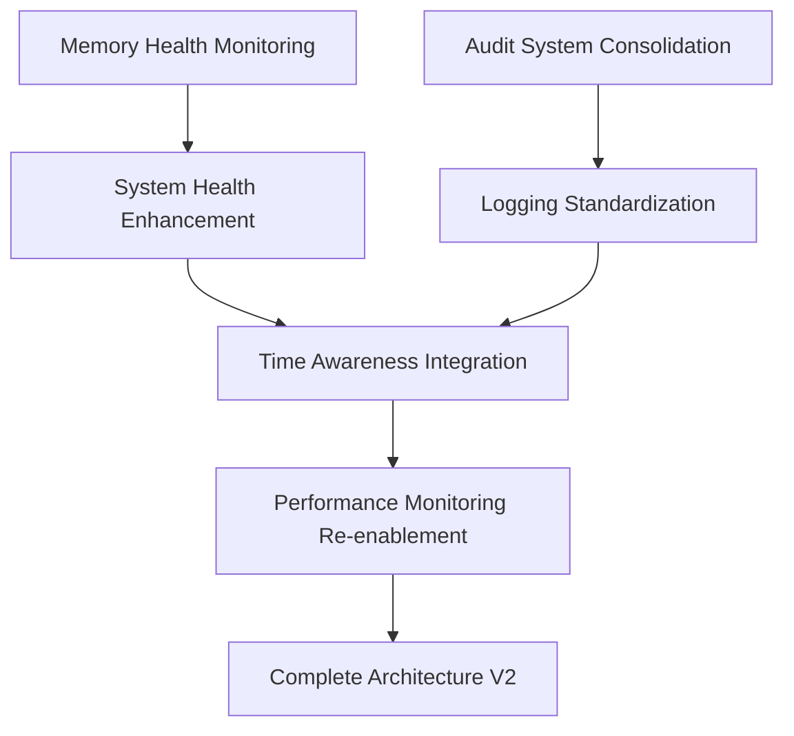

# 🚀 OneAgent Next Phase Implementation Roadmap
**Post-Optimization Phase** | **December 6, 2025**

## Executive Summary
With OneAgent memory system successfully optimized to **"optimal"** status, this document outlines the next phase of architectural improvements focusing on real-time monitoring, system consolidation, and advanced feature integration.

## Phase 2 Strategic Objectives

### 🎯 Primary Goals
1. **Real-time Memory Health Validation** - Implement continuous system monitoring
2. **Audit System Consolidation** - Standardize on production audit infrastructure
3. **Time Awareness Integration** - Add temporal context to memory operations
4. **Performance Monitoring Enhancement** - Smart threshold-based monitoring system

## 📋 Implementation Priority Matrix

### 🔴 **HIGH PRIORITY** (Immediate Implementation)

#### 1. Memory Health Monitoring Integration
**Issue**: TriageAgent has validation capabilities but server not calling real-time validation  
**Impact**: Missing continuous health monitoring despite having the infrastructure

```typescript
// Required Implementation in oneagent-mcp-copilot.ts
async function getSystemHealth() {
  // MISSING: Real-time memory validation
  const memoryValidation = await triageAgent.revalidateMemorySystem();
  
  return {
    memorySystem: {
      // ...existing code...
      validation: memoryValidation,  // ADD THIS
      realTimeHealth: memoryValidation.status
    }
  };
}
```

**Dependencies**: 
- TriageAgent framework (✅ Available)
- Memory bridge interface (✅ Implemented)
- Server health endpoint (✅ Active)

**Estimated Effort**: 2-3 hours
**Risk Level**: Low (existing infrastructure)

#### 2. Audit System Consolidation
**Issue**: Dual audit systems creating architectural inconsistency  
**Impact**: Code duplication, potential logging conflicts, maintenance overhead

```typescript
// Current State (Problematic):
{
  production: "coreagent/audit/auditLogger.ts",     // 291 lines, full-featured
  compatibility: "coreagent/tools/auditLogger.ts"   // 105 lines, bridge interface
}

// Target State (Consolidated):
{
  primary: "coreagent/audit/auditLogger.ts",        // Enhanced production logger
  removed: "coreagent/tools/auditLogger.ts"         // Eliminate compatibility layer
}
```

**Dependencies**:
- All tools using compatibility logger (✅ Identified)
- Production audit logger (✅ Fully functional)
- Import path updates required

**Estimated Effort**: 4-5 hours
**Risk Level**: Medium (affects multiple components)

### 🟡 **MEDIUM PRIORITY** (Next Sprint)

#### 3. Time Awareness Integration
**Issue**: Memory system lacks temporal context integration  
**Impact**: Missing time-aware search, context relevance, temporal analytics

```typescript
// Required Enhancement:
interface MemoryWithTimeContext {
  content: string;
  timeContext: {
    created: Date;
    lastAccessed: Date;
    relevanceWindow: TimeWindow;
    temporalTags: string[];
  };
  searchRelevance: (currentTime: Date) => number;
}

// Integration Point:
function getCurrentTimeContext(): TimeContext {
  return {
    current: new Date(),
    session: getSessionTimeframe(),
    userTimezone: getUserTimezone(),
    contextualRelevance: calculateTemporalRelevance()
  };
}
```

**Dependencies**:
- Memory bridge architecture (✅ Optimized)
- Time zone handling (⚠️ Needs implementation)
- Temporal search algorithms (⚠️ Needs design)

**Estimated Effort**: 8-10 hours
**Risk Level**: Medium (new feature complexity)

#### 4. Performance Monitoring Re-enablement
**Issue**: Performance tracking temporarily disabled for optimization  
**Impact**: Missing performance insights for production optimization

```typescript
// Current State (Disabled for optimization):
enablePerformanceTracking: false

// Target State (Smart monitoring):
enablePerformanceTracking: true,
smartThresholds: {
  adaptiveThresholds: true,
  learningEnabled: true,
  alerting: "intelligent",
  degradationDetection: "predictive"
}
```

**Dependencies**:
- Optimized memory bridge (✅ Implemented)
- Performance baseline (✅ Established)
- Smart threshold algorithms (⚠️ Needs design)

**Estimated Effort**: 6-8 hours
**Risk Level**: Low (enhancement to existing system)

## 🔗 Dependency Analysis

### Implementation Flow


### Prerequisites Check
| Component | Status | Notes |
|-----------|--------|-------|
| Optimized Memory Bridge | ✅ Ready | Foundation complete |
| TriageAgent Framework | ✅ Ready | Validation methods available |
| Production Audit Logger | ✅ Ready | Full-featured implementation |
| MCP Server Health | ✅ Ready | Port 8083 operational |
| Constitutional AI | ✅ Ready | 4 principles active |

## 🎯 Goal Alignment Assessment

### User's Broader Objectives
1. **Production-Ready System**: ✅ Achieved with optimal memory performance
2. **Professional Quality Standards**: ✅ 86.8% quality score (Grade A)
3. **Scalable Architecture**: 🔄 Phase 2 will enhance scalability
4. **Real-time Monitoring**: 🎯 Primary focus of next phase
5. **Enterprise-Grade Reliability**: 🔄 Consolidation will improve reliability

### Strategic Value Proposition
- **Immediate**: Real-time health monitoring prevents future degradation
- **Short-term**: System consolidation reduces maintenance overhead
- **Medium-term**: Time awareness enables advanced AI capabilities  
- **Long-term**: Smart monitoring provides predictive optimization

## 📊 Implementation Recommendations

### Phase 2A: Foundation Enhancement (Week 1)
1. **Memory Health Monitoring** - Implement TriageAgent integration
2. **Audit System Consolidation** - Standardize on production logger

### Phase 2B: Advanced Features (Week 2-3)
3. **Time Awareness Integration** - Add temporal context capabilities
4. **Performance Monitoring** - Re-enable with smart thresholds

### Phase 2C: Optimization (Week 4)
5. **System Integration Testing** - Comprehensive validation
6. **Documentation Updates** - Reflect new architecture

## 🛡️ Risk Mitigation Strategy

### High Priority Risks
1. **Audit System Migration**: 
   - Mitigation: Gradual migration with fallback capability
   - Validation: Comprehensive logging tests

2. **Time Awareness Complexity**:
   - Mitigation: Incremental implementation with feature flags
   - Validation: A/B testing with existing functionality

3. **Performance Impact**:
   - Mitigation: Smart threshold algorithms with adaptive learning
   - Validation: Real-time performance monitoring

## ✅ Completion Criteria & Success Metrics

### Technical Success Criteria
- [ ] Real-time memory validation operational
- [ ] Single audit system with full feature parity
- [ ] Time-aware memory search functionality
- [ ] Smart performance monitoring active
- [ ] All existing functionality preserved

### Quality Success Criteria
- [ ] Quality score maintained above 85% (Grade A)
- [ ] Constitutional AI compliance at 100%
- [ ] System health status remains "optimal"
- [ ] Error rate stays below 1%
- [ ] Response latency within optimized thresholds

## 🚀 Execution Readiness Assessment

### Information Sufficiency: ✅ **PROCEED WITH CONFIDENCE**
- Architecture analysis complete
- Dependencies mapped and validated
- Implementation patterns established
- Risk mitigation strategies defined
- Success criteria clearly outlined

### Next Immediate Action
**START WITH**: Memory Health Monitoring integration - lowest risk, highest impact improvement that leverages existing TriageAgent infrastructure.

---

**Strategic Assessment**: OneAgent is well-positioned for Phase 2 enhancements. The successful optimization to "optimal" status provides a solid foundation for advanced architectural improvements. All prerequisites are in place for confident execution.

**Recommendation**: Proceed with implementation in the defined priority order, starting with memory health monitoring integration as the foundation for subsequent enhancements.
